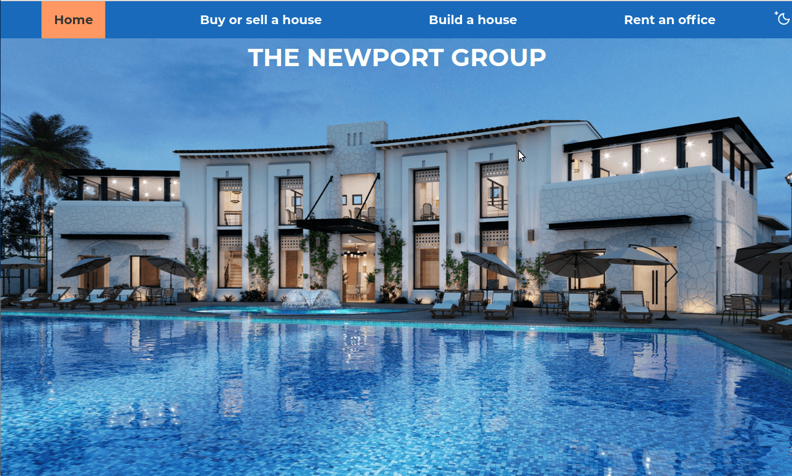

# The Newport Group
> Website for the fictional estate agent, The Newport Group, from The OC.

## Table of contents
* [General info](#general-info)
* [Screenshots](#screenshots)
* [Technologies](#technologies)
* [Learnings](#learnings)
* [Setup](#setup)
* [Features](#features)
* [Status](#status)
* [Inspiration](#inspiration)
* [Contact](#contact)

## General info
I wanted to make a multi-page website, partly because it's been a long time since I designed and created a site. I also learnt about doing some flashy things in CSS and since this is a luxury brand, it seemed like a good site to try them out on.
Since it was a multi-page site I intended to use the HTML template tag, but React seemed easier. Having just done a tutorial a little JSX would be the perfect introduction. And then I found it all needed to be in React...

## Screenshots


## Technologies
* HTML
* SASS
* React
* Parcel
* Jest
* Enzyme
* React Testing Library
* Cypress

## Learnings
* React...
* React Router
* React Hooks

## Features
Light/dark mode

## Setup
To view this project visit the [demo](https://the-newport-group.nicm42.co.uk/) or download the files, open a terminal in that folder and install locally using npm:
```
npm install
parcel .src/index.html --open
```

## Status
Project is: _finished_

## Inspiration
The OC and a lot of Kevin Powell tutorials

## Contact
Created by [nicm42](https://twitter.com/nicm4242/) - feel free to contact me!
